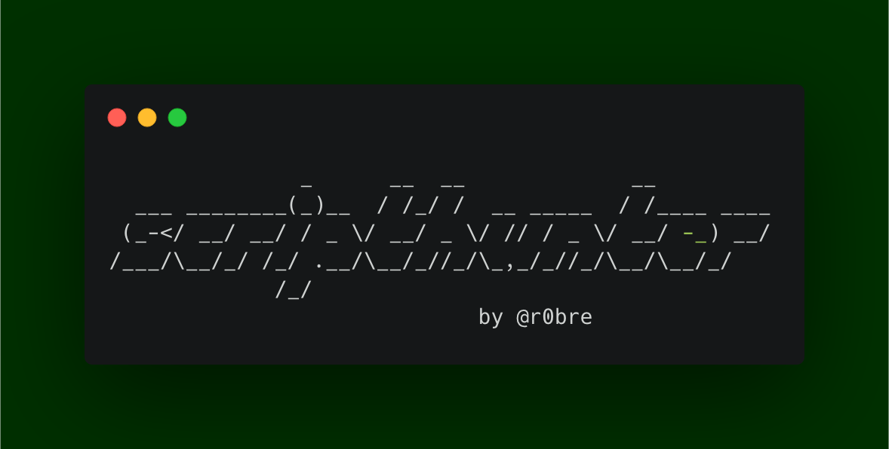

## scripthunter

Scripthunter is a tool that finds javascript files for a given website. To scan goole, simply run `./scripthunter.sh https://google.com`. Note that it may take a while, which is why scripthunter also implements a notification mechanism to inform you when a scan is finished via Telegram API. [Blogpost]()


### Setup

To install scripthunter, clone this repository. Scripthunter relies on a couple of tools to be installed so make sure you have them:
- gau
- ffuf
- hakrawler
- httpx

Furthermore, scripthunter uses Telegram to send you a notification once a scan is finished. To enable this feature, you need to create a Telegram Bot and paste your Bot API key and chatid in the scripthunter script.
You can follow [this](https://blog.r0b.re/automation/bash/2020/06/30/setup-telegram-notifications-for-your-shell.html) guide to get these values.


### Features

- Extract public javascript files from website using Gau and Hakrawler
- Parse directories containing js files from found public files
- Scan js directories for hidden js files using ffuf and a custom wordlist
- check all found files for connectivity
- notify user once scans are finished
- aggregate all seen js filenames into one global wordlist

### Example
I ran this on some random verizon subdomain:
```bash
➜  scripthunter-dev ./scripthunter.sh https://developer.verizonmedia.com/
               _      __  __             __
  ___ ________(_)__  / /_/ /  __ _____  / /____ ____
 (_-</ __/ __/ / _ \/ __/ _ \/ // / _ \/ __/ -_) __/
/___/\__/_/ /_/ .__/\__/_//_/\_,_/_//_/\__/\__/_/
             /_/
                             by @r0bre
[*] Running GAU
[+] GAU found 7 scripts!
[*] Running hakrawler
[+] HAKRAWLER found 5 scripts!
[*] Found 2 directories containing .js files.
[*] Running FFUF on https://developer.verizonmedia.com/./

[+] FFUF found 0 scripts in https://developer.verizonmedia.com/./ !
[*] Running FFUF on https://developer.verizonmedia.com/assets/

[+] FFUF found 0 scripts in https://developer.verizonmedia.com/assets/ !
[*] Running FFUF on https://developer.verizonmedia.com/assets/js/

[+] FFUF found 0 scripts in https://developer.verizonmedia.com/assets/js/ !
[*] Running FFUF on https://developer.verizonmedia.com/js/

[+] FFUF found 0 scripts in https://developer.verizonmedia.com/js/ !
[*] Running FFUF on https://developer.verizonmedia.com/static/

[+] FFUF found 0 scripts in https://developer.verizonmedia.com/static/ !
[*] Running FFUF on https://developer.verizonmedia.com/static/js/

[+] FFUF found 7 scripts in https://developer.verizonmedia.com/static/js/ !
[*] Running FFUF on https://developer.verizonmedia.com/static/js/vendor/

[+] FFUF found 3 scripts in https://developer.verizonmedia.com/static/js/vendor/ !
[+] Checking Script Responsiveness of 13 scripts..
https://developer.verizonmedia.com/static/js/vendor/js-cookie.js
https://developer.verizonmedia.com/static/js/jquery-3.3.1.min.js
https://developer.verizonmedia.com/static/js/autotrack.js
https://developer.verizonmedia.com/static/js/utils.js
https://developer.verizonmedia.com/static/js/navigation.js
https://developer.verizonmedia.com/static/js/vendor/rapidworker-1.2.js
https://developer.verizonmedia.com/static/js/vmdn.js
https://developer.verizonmedia.com/static/js/right-nav.js
[+] All Done!
[+] Found total of 13 (8 responsive) scripts!
```


If you like this tool, consider following me on Twitter [@r0bre](https://twitter.com/r0bre)! ;)

